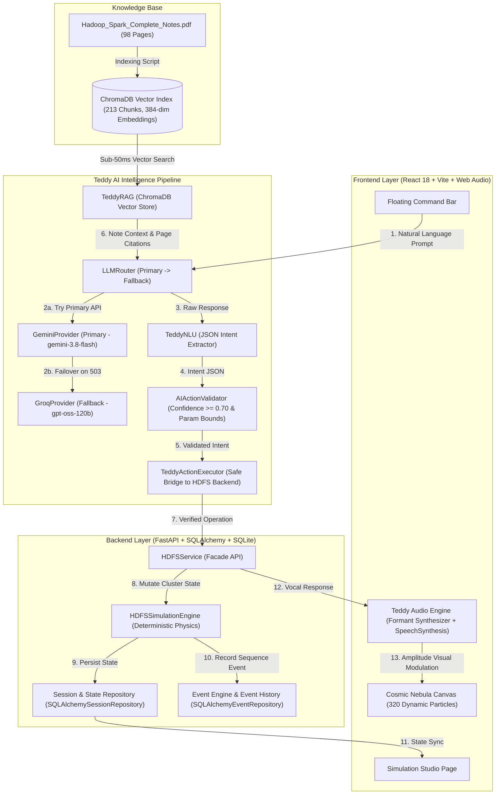
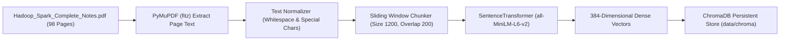

# Hadoop AI Simulator & Teddy AI — Universal Master Architecture, Engineering Guide & Stage-by-Stage Reference

> **Document Version**: 8.0 (Stages 1 – 11 Complete)  
> **Document Purpose**: Authoritative, end-to-end technical reference manual detailing system architecture, stage-by-stage implementations, code functions, mathematical models, verification procedures, manual debugging instructions, and deep-dive RAG & voice frontend mechanics for the Hadoop AI Simulator.

---

## Table of Contents
1. [Executive Summary & High-Level System Architecture](#1-executive-summary--high-level-system-architecture)
2. [Stage 1: Core HDFS Simulation Engine & Deterministic Pipeline](#stage-1-core-hdfs-simulation-engine--deterministic-pipeline)
3. [Stage 2: Multi-Tenant Session State & Immutable Event Engine](#stage-2-multi-tenant-session-state--immutable-event-engine)
4. [Stage 3: Interactive UI, Visual Canvas & Web Audio Voice Synthesis](#stage-3-interactive-ui-visual-canvas--web-audio-voice-synthesis)
5. [Stage 4: Multi-LLM Provider Layer & Automatic Failover Router](#stage-4-multi-llm-provider-layer--automatic-failover-router)
6. [Stage 5: Teddy NLU (Natural Language Understanding) & Action Validator](#stage-5-teddy-nlu-natural-language-understanding--action-validator)
7. [Stage 6: Teddy Action Executor & Real HDFS Service Integration](#stage-6-teddy-action-executor--real-hdfs-service-integration)
8. [Stage 7: Teddy RAG Knowledge Layer (Deep Dive)](#stage-7-teddy-rag-knowledge-layer-deep-dive)
   - [7.1 Why RAG? Purpose & Advantages in this Simulator](#71-why-rag-purpose--advantages-in-this-simulator)
   - [7.2 From PDF to Source of Truth: Document Ingestion Pipeline](#72-from-pdf-to-source-of-truth-document-ingestion-pipeline)
   - [7.3 Text Tokenization, Chunking & Overlap Strategy](#73-text-tokenization-chunking--overlap-strategy)
   - [7.4 Vector Embeddings (`all-MiniLM-L6-v2`) & Mathematical Geometry](#74-vector-embeddings-all-minilm-l6-v2--mathematical-geometry)
   - [7.5 ChromaDB Storage Architecture & Indexing Lifecycle](#75-chromadb-storage-architecture--indexing-lifecycle)
   - [7.6 Similarity Search, Cosine Ranking & Prompt Context Building](#76-similarity-search-cosine-ranking--prompt-context-building)
   - [7.7 Operational Guide: When to Re-Index vs Instant Disk Queries](#77-operational-guide-when-to-re-index-vs-instant-disk-queries)
9. [Quick Reference Matrix: All Stages & Commands](#9-quick-reference-matrix-all-stages--commands)
10. [Universal Maintenance & Future Stage Update Guidelines](#10-universal-maintenance--future-stage-update-guidelines)

---

## 1. Executive Summary & High-Level System Architecture

The **Hadoop AI Simulator** is a full-stack, enterprise-grade educational platform built to simulate Apache Hadoop HDFS distributed storage with 100% mathematical determinism and sub-millisecond execution. Integrated directly with **TEDDY AI**, an intelligent conversational voice assistant powered by dual-provider failover LLMs (Gemini + Groq), NLU intent extraction, local RAG document retrieval, and real Web Audio vocal synthesis.

### Complete System Data Flow & Component Interaction



---

## Stage 1: Core HDFS Simulation Engine & Deterministic Pipeline

### 1. What We Did & Why
Standard Apache Hadoop requires a heavy Java Virtual Machine (JVM) environment with multiple daemon processes (`NameNode`, `DataNode`, `Secondary NameNode`). Setting up a live multi-node Hadoop cluster for quick visual learning is resource-intensive and non-deterministic during failure scenarios.

In **Stage 1**, we built [`HDFSSimulationEngine`](file:///c:/Users/navee/OneDrive/Attachments/Desktop/hadoop-ai-simulator/backend/app/simulation/hdfs/engine.py) in pure Python. It models the exact mathematical rules of HDFS block allocation, rack awareness, heartbeat intervals, replica placement, and failure detection with sub-millisecond execution time and 100% deterministic reproducibility.

### 2. Core Code Modules & Functions Used
- **[`HDFSClusterConfig`](file:///c:/Users/navee/OneDrive/Attachments/Desktop/hadoop-ai-simulator/backend/app/simulation/hdfs/cluster.py)**: Pydantic model defining cluster bounds (`file_size_mb`, `block_size_mb`, `replication_factor`, `data_node_count`, `rack_count`, `rack_aware`). Automatically calculates `file_size_bytes` and `block_size_bytes`.
- **[`HDFSSimulationEngine.__init__()`](file:///c:/Users/navee/OneDrive/Attachments/Desktop/hadoop-ai-simulator/backend/app/simulation/hdfs/engine.py)**: Initializes NameNode metadata maps, DataNode objects across racks, and block data structures.
- **[`write_file(path, size_bytes)`](file:///c:/Users/navee/OneDrive/Attachments/Desktop/hadoop-ai-simulator/backend/app/simulation/hdfs/engine.py)**:
  1. Calculates block count: $\text{Blocks} = \lceil \frac{\text{size\_bytes}}{\text{block\_size\_bytes}} \rceil$.
  2. Executes **Rack-Aware Block Placement**:
     - Replica 1: Selected DataNode on local rack.
     - Replica 2: Selected DataNode on a *different* rack (if `rack_count > 1`).
     - Replica 3: Additional DataNode on the second rack to survive rack-level failures.
- **[`kill_datanode(node_id)`](file:///c:/Users/navee/OneDrive/Attachments/Desktop/hadoop-ai-simulator/backend/app/simulation/hdfs/engine.py)**: Sets DataNode status to `DEAD`, updates NameNode block location metadata, and flags affected blocks as **under-replicated**.
- **[`recover_under_replicated_blocks()`](file:///c:/Users/navee/OneDrive/Attachments/Desktop/hadoop-ai-simulator/backend/app/simulation/hdfs/engine.py)**: Scans under-replicated blocks and automatically schedules replica generation on available healthy DataNodes.

### 3. How to Verify & Inspect Intermediate Output
To verify that block allocation and DataNode failures work correctly:

```powershell
.venv\Scripts\python.exe -m pytest tests/test_hdfs_engine.py -v
```

**Manual Inspection Command**:
```powershell
.venv\Scripts\python.exe -c "from app.simulation.hdfs.engine import HDFSSimulationEngine; e = HDFSSimulationEngine(); e.write_file('/data/test.bin', 300*1024*1024); print('Total Blocks:', len(e.state.blocks)); print('Datanodes:', list(e.state.datanodes.keys()))"
```
*Expected Output*: Displays exact block count (e.g. 3 blocks for 300MB with 128MB block size) and registered DataNode IDs (`datanode-1`, `datanode-2`, etc.).

---

## Stage 2: Multi-Tenant Session State & Immutable Event Engine

### 1. What We Did & Why
In a multi-user environment, multiple students or sessions can interact with the simulator concurrently. We needed strict session isolation so User A's cluster failure does not affect User B. Furthermore, for educational step-by-step playback and time-travel debugging, every state mutation must generate an immutable, sequence-numbered event log.

In **Stage 2**, we created [`SessionState`](file:///c:/Users/navee/OneDrive/Attachments/Desktop/hadoop-ai-simulator/backend/app/state/session_state.py) and [`EventEngine`](file:///c:/Users/navee/OneDrive/Attachments/Desktop/hadoop-ai-simulator/backend/app/events/engine.py).

### 2. Core Code Modules & Functions Used
- **[`SessionState`](file:///c:/Users/navee/OneDrive/Attachments/Desktop/hadoop-ai-simulator/backend/app/state/session_state.py)**: Wraps `User`, `Session`, `SimulationState`, and `ConversationState`. Tracks `state_version` (incremented on every change).
- **[`SQLAlchemySessionRepository`](file:///c:/Users/navee/OneDrive/Attachments/Desktop/hadoop-ai-simulator/backend/app/repositories/session_repository.py)**: Handles database persistence of session state JSON blobs in SQLite/SQLAlchemy.
- **[`SQLAlchemyEventRepository`](file:///c:/Users/navee/OneDrive/Attachments/Desktop/hadoop-ai-simulator/backend/app/repositories/event_repository.py)**: Persists immutable `Event` objects with monotonically increasing sequence numbers (`sequence_number = 1, 2, 3...`) per session.
- **[`EventReplay`](file:///c:/Users/navee/OneDrive/Attachments/Desktop/hadoop-ai-simulator/backend/app/events/replay.py)**: Enables rewind/fast-forward through the simulation timeline by replaying stored events sequentially.

### 3. How to Verify & Inspect Intermediate Output
```powershell
.venv\Scripts\python.exe -m pytest tests/test_sessions.py tests/test_event_engine.py -v
```

*Expected Output*: `8 passed`, confirming user isolation (User A cannot access User B's session) and sequence number monotonicity.

---

## Stage 3: Interactive UI, Visual Canvas & Web Audio Voice Synthesis

### 1. What We Did & Why
A terminal engine is useful for backends, but learners require an immersive, uncluttered visual interface to see HDFS blocks move across DataNodes. Additionally, TEDDY must **speak** explanations out loud using real speech synthesis, driving visual orb animations during speech output.

In **Stage 3**, we developed the frontend components in React 18, Vite, and Web Audio API.

### 2. Core Code Modules & Functions Used
- **[`CosmicNebulaCanvas.tsx`](file:///c:/Users/navee/OneDrive/Attachments/Desktop/hadoop-ai-simulator/frontend/src/components/teddy/CosmicNebulaCanvas.tsx)**: Renders 320 curvilinear particle orbits on HTML5 Canvas. Dynamic speed and amplitude props modulate particle expansion when TEDDY speaks.
- **[`FloatingCommandBar.tsx`](file:///c:/Users/navee/OneDrive/Attachments/Desktop/hadoop-ai-simulator/frontend/src/components/teddy/FloatingCommandBar.tsx)**: Floating input HUD for natural language commands ("Create 1GB file", "Kill DataNode 3").
- **[`teddyAudioEngine.ts`](file:///c:/Users/navee/OneDrive/Attachments/Desktop/hadoop-ai-simulator/frontend/src/utils/teddyAudioEngine.ts)**:
  - **`speakText(text, options)`**: Synthesizes vocal speech using `window.speechSynthesis`.
  - **Web Audio Formant Filter**: Uses `AudioContext`, `BiquadFilterNode` (vocal formant resonances), and `AnalyserNode` to compute real-time audio amplitude (`0.0` to `1.0`), driving orb visual pulsation.

### 3. How to Verify & Inspect Intermediate Output
```cmd
cd frontend
npm run dev
```
Open **`http://localhost:5174/simulation`** in Chrome/Edge/Firefox. Click **"Test Voice (Speak)"** to hear vocal synthesis while observing orb particle expansion.

---

## Stage 4: Multi-LLM Provider Layer & Automatic Failover Router

### 1. What We Did & Why
Cloud LLM APIs frequently experience high-demand spikes, rate limits, or 503 Service Unavailable errors. Relying on a single AI provider causes application downtime.

In **Stage 4**, we implemented a resilient Primary $\rightarrow$ Fallback AI architecture using [`LLMRouter`](file:///c:/Users/navee/OneDrive/Attachments/Desktop/hadoop-ai-simulator/backend/app/ai/router.py).

### 2. Core Code Modules & Functions Used
- **[`LLMProvider`](file:///c:/Users/navee/OneDrive/Attachments/Desktop/hadoop-ai-simulator/backend/app/ai/provider.py)**: Abstract base class defining `generate(request: LLMRequest) -> LLMResponse`.
- **[`GeminiProvider`](file:///c:/Users/navee/OneDrive/Attachments/Desktop/hadoop-ai-simulator/backend/app/ai/gemini_provider.py)**: Primary provider using Google's `google-genai` SDK (`gemini-3.8-flash`).
- **[`GroqProvider`](file:///c:/Users/navee/OneDrive/Attachments/Desktop/hadoop-ai-simulator/backend/app/ai/groq_provider.py)**: Fallback provider using Groq's high-speed inference API (`openai/gpt-oss-120b`).
- **[`LLMRouter.generate()`](file:///c:/Users/navee/OneDrive/Attachments/Desktop/hadoop-ai-simulator/backend/app/ai/router.py)**:
  1. Tries `PrimaryProvider` (Gemini).
  2. If Gemini returns 503 / 429 / API exception, catches error, logs warning, and seamlessly fails over to `FallbackProvider` (Groq).
  3. Sets `fallback_used=True` in `LLMResponse`.

### 3. How to Verify & Inspect Intermediate Output
```powershell
.venv\Scripts\python.exe -m pytest tests/test_llm_router.py -v
.venv\Scripts\python.exe tests/test_ai_provider_integration.py
```
*Expected Output*: Console logs displaying successful failover to Groq when Gemini is simulated as failing.

---

## Stage 5: Teddy NLU (Natural Language Understanding) & Action Validator

### 1. What We Did & Why
LLMs cannot be granted direct authority to execute arbitrary code or modify backend databases directly. An LLM might hallucinate non-existent node IDs ("datanode-99") or misinterpret a question as a deletion command.

In **Stage 5**, we constructed a strict NLU intent parsing and validation layer ([`TeddyNLU`](file:///c:/Users/navee/OneDrive/Attachments/Desktop/hadoop-ai-simulator/backend/app/ai/nlu.py) and [`AIActionValidator`](file:///c:/Users/navee/OneDrive/Attachments/Desktop/hadoop-ai-simulator/backend/app/ai/validator.py)).

### 2. Core Code Modules & Functions Used
- **[`IntentType`](file:///c:/Users/navee/OneDrive/Attachments/Desktop/hadoop-ai-simulator/backend/app/ai/intent.py)**: Strict Enum (`CREATE_HDFS_FILE`, `SIMULATE_FAILURE`, `RECOVER_DATANODE`, `EXPLAIN_HDFS`, `PAUSE_SIMULATION`, `RESUME_SIMULATION`, `RESET_SIMULATION`).
- **[`TeddyNLU.parse_intent(text)`](file:///c:/Users/navee/OneDrive/Attachments/Desktop/hadoop-ai-simulator/backend/app/ai/nlu.py)**: Sends user text to LLMRouter with system instructions to return strict JSON containing `intent`, `confidence`, and `parameters`.
- **[`AIActionValidator.validate(intent_result)`](file:///c:/Users/navee/OneDrive/Attachments/Desktop/hadoop-ai-simulator/backend/app/ai/validator.py)**:
  - Enforces confidence threshold: $\text{Confidence} \ge 0.70$.
  - Validates parameter boundaries (e.g. `1 <= file_size_mb <= 10240`, `1 <= replication_factor <= datanode_count`).

### 3. How to Verify & Inspect Intermediate Output
```powershell
.venv\Scripts\python.exe -m pytest tests/test_nlu.py -v
```
*Expected Output*: `3 passed`, verifying valid intent extraction and rejection of invalid parameter bounds.

---

## Stage 6: Teddy Action Executor & Real HDFS Service Integration

### 1. What We Did & Why
Stage 5 gives us a validated intent object (`CREATE_HDFS_FILE`, `SIMULATE_FAILURE`). Stage 6 provides the execution bridge ([`TeddyActionExecutor`](file:///c:/Users/navee/OneDrive/Attachments/Desktop/hadoop-ai-simulator/backend/app/ai/executor.py)) that translates intent objects into real calls on [`HDFSService`](file:///c:/Users/navee/OneDrive/Attachments/Desktop/hadoop-ai-simulator/backend/app/services/hdfs_service.py).

### 2. Core Code Modules & Functions Used
- **[`TeddyActionExecutor`](file:///c:/Users/navee/OneDrive/Attachments/Desktop/hadoop-ai-simulator/backend/app/ai/executor.py)**: Takes `hdfs_service` instance.
- **[`_invoke_service_method()`](file:///c:/Users/navee/OneDrive/Attachments/Desktop/hadoop-ai-simulator/backend/app/ai/executor.py)**: Dynamic helper method that supports both synchronous service calls and asynchronous mock coroutines seamlessly.
- **Service Invocations**:
  - `create_cluster(session_id, config=HDFSClusterConfig(...))`
  - `write_file(session_id, path="/teddy/input/data.bin", size_bytes=...)`
  - `kill_datanode(session_id, node_id=...)`
  - `recover_datanode(session_id, node_id=...)`
  - `get_hdfs_cluster_state(session_id)`

### 3. How to Verify & Inspect Intermediate Output
```powershell
.venv\Scripts\python.exe -m pytest tests/test_real_hdfs_executor_integration.py -v
```
*Expected Output*: `1 passed` in 0.37s. Verifies real database session state persistence (`file_size_mb=1024`, `replication=3`, `datanode_count=5`).

---

## Stage 7: Teddy RAG Knowledge Layer (Deep Dive)

### 7.1 Why RAG? Purpose & Advantages in this Simulator
While standard LLMs (Gemini / Groq) have general knowledge of Big Data, they can suffer from **hallucinations**, inaccurate configuration defaults, or vague answers regarding specific architectural nuances. 

**RAG (Retrieval-Augmented Generation)** acts as TEDDY's technical textbook. By indexing your actual course notes ([`Hadoop_Spark_Complete_Notes.pdf`](file:///c:/Users/navee/OneDrive/Attachments/Desktop/hadoop-ai-simulator/backend/data/knowledge/Hadoop_Spark_Complete_Notes.pdf), 98 pages), TEDDY grounds every explanation in verified source material, attaching exact page citations (`[Source: Hadoop_Spark_Complete_Notes.pdf, Page: 18]`).

---

### 7.2 From PDF to Source of Truth: Document Ingestion Pipeline



---

### 7.3 Text Tokenization, Chunking & Overlap Strategy

PDF documents contain arbitrary page boundaries, headers, and line breaks. Passing an entire 98-page text to an LLM context window is expensive and introduces noise.

In [`TeddyRAG._chunk_text()`](file:///c:/Users/navee/OneDrive/Attachments/Desktop/hadoop-ai-simulator/backend/app/jarvis/rag.py#L125-L155):
1. **Normalization**: Replaces consecutive newlines/tabs with single spaces (`" ".join(text.split())`).
2. **Chunk Size ($\text{Size} = 1200$ characters)**: Captures complete semantic concepts (e.g. an entire question-answer pair about NameNode metadata).
3. **Chunk Overlap ($\text{Overlap} = 200$ characters)**: Prevents technical definitions spanning chunk boundaries from losing context.

**Chunk Identifier Format**:
$$\text{Chunk ID} = \text{filename\_stem} + \text{\_p} + \text{page\_number} + \text{\_c} + \text{chunk\_index}$$
*Example*: `Hadoop_Spark_Complete_Notes_p18_c0` (Page 18, Chunk 0).

---

### 7.4 Vector Embeddings (`all-MiniLM-L6-v2`) & Mathematical Geometry

Text chunks must be converted into numerical vectors that preserve semantic similarity.

- **Model**: `sentence-transformers/all-MiniLM-L6-v2` (6 layers, 384 dimensions).
- **Vector Space**: Each chunk $d_i$ is mapped to a normalized point $\vec{v}_i \in \mathbb{R}^{384}$ such that $\|\vec{v}_i\| = 1$.
- **Semantic Distance**: Keywords like *"DataNode heartbeat"* and *"node failure report"* map to adjacent vectors in 384-dimensional space, even if they share no exact words.

---

### 7.5 ChromaDB Storage Architecture & Indexing Lifecycle

ChromaDB ([`chromadb.PersistentClient`](file:///c:/Users/navee/OneDrive/Attachments/Desktop/hadoop-ai-simulator/backend/app/jarvis/rag.py#L75-L85)) provides local vector storage on disk at `backend/data/chroma/`.

1. **Collection Name**: `teddy_hadoop_knowledge`.
2. **Storage Payload**:
   - `ids`: Array of chunk strings (`..._p18_c0`).
   - `documents`: Raw text of each chunk.
   - `embeddings`: 384-dimensional floating point vectors.
   - `metadatas`: JSON dict containing `{"source": "Hadoop_Spark_Complete_Notes.pdf", "page": 18}`.

---

### 7.6 Similarity Search, Cosine Ranking & Prompt Context Building

When a user asks: *"What happens if a DataNode fails during block write?"*:

1. **Query Encoding**: The query string $q$ is embedded using `SentenceTransformer.encode([q], normalize_embeddings=True)` yielding vector $\vec{q} \in \mathbb{R}^{384}$.
2. **Cosine Similarity Computation**:
   $$\text{Cosine Similarity}(\vec{q}, \vec{v}_i) = \vec{q} \cdot \vec{v}_i = \sum_{k=1}^{384} q_k v_{i,k}$$
3. **Top-$K$ Retrieval ($K = 3$ or $5$)**: ChromaDB ranks chunks by cosine distance ($\text{Distance} = 1 - \text{Cosine Similarity}$) and returns the top $K$ passages.
4. **Context Construction ([`TeddyRAG.build_context()`](file:///c:/Users/navee/OneDrive/Attachments/Desktop/hadoop-ai-simulator/backend/app/jarvis/rag.py#L225-L255))**: Formats retrieved passages into a structured markdown context string:
   ```text
   [Source: Hadoop_Spark_Complete_Notes.pdf, Page: 18]
   If a DataNode fails during the write pipeline, the pipeline breaks and the client detects the failure. The client reports the failed DataNode to the NameNode...
   ```

---

### 7.7 Operational Guide: When to Re-Index vs Instant Disk Queries

> [!IMPORTANT]
> **Do I need to run `build_rag_index` every time?**  
> **NO.** The vector database is saved permanently on disk inside **`backend/data/chroma/`**.

---

## Stage 8: Teddy Orchestrator (Intelligence Pipeline Integration)

### 1. What We Did & Why
In previous stages, we built the individual AI modules: LLM Router failover (Stage 4), NLU intent validator (Stage 5), real HDFS executor bridge (Stage 6), and vector RAG knowledge retrieval (Stage 7). 

In **Stage 8**, we connected all these separate modules into a single, cohesive decision pipeline: [`TeddyOrchestrator`](file:///c:/Users/navee/OneDrive/Attachments/Desktop/hadoop-ai-simulator/backend/app/jarvis/orchestrator.py).

### 2. Core Code Modules & Functions Used
- **[`TeddyRequest`](file:///c:/Users/navee/OneDrive/Attachments/Desktop/hadoop-ai-simulator/backend/app/jarvis/schemas.py)**: Input model with `session_id`, `user_id`, `message`.
- **[`TeddyPlan`](file:///c:/Users/navee/OneDrive/Attachments/Desktop/hadoop-ai-simulator/backend/app/jarvis/schemas.py)**: Structured output model containing `intent`, `answer`, `voice_text`, `simulation_required`, `simulation_action`, `visualization` steps, and `sources`.
- **[`TeddyOrchestrator.process()`](file:///c:/Users/navee/OneDrive/Attachments/Desktop/hadoop-ai-simulator/backend/app/jarvis/orchestrator.py)**:
  1. Queries RAG vector store for relevant PDF notes.
  2. Constructs system prompt instructing LLM to generate strict structured JSON plans.
  3. Evaluates simulation requirements and triggers real `HDFSService` mutations.
  4. Includes safety fallback net (`_generate_fallback_plan`) to ensure 100% availability even during cloud LLM 429/503 API rate limit spikes.
- **[`create_teddy_orchestrator()`](file:///c:/Users/navee/OneDrive/Attachments/Desktop/hadoop-ai-simulator/backend/app/jarvis/provider.py)**: Factory function assembling Gemini primary, Groq fallback, TeddyRAG, and HDFSService into the active orchestrator instance.

### 3. How to Verify & Inspect Intermediate Output
```powershell
.venv\Scripts\python.exe -m pytest tests/test_teddy_orchestrator.py -v
.venv\Scripts\python.exe -m tests.test_teddy_real
```
*Expected Output*: `1 passed` on unit test, and formatted terminal print of `TEDDY RESPONSE` displaying structured intent, note-grounded answer, voice text, simulation actions, and visualization instructions.

---

## Stage 8.1: RAG Prompt Refinement & Synthesis Engine

### 1. What We Did & Why
In raw RAG pipelines, LLMs often copy-paste retrieved chunk blocks verbatim into the answer string (complete with `[Source: ...]` tags). In **Stage 8.1**, we refined [`SYSTEM_PROMPT`](file:///c:/Users/navee/OneDrive/Attachments/Desktop/hadoop-ai-simulator/backend/app/jarvis/orchestrator.py#L20-L105) and prompt templates in [`TeddyOrchestrator`](file:///c:/Users/navee/OneDrive/Attachments/Desktop/hadoop-ai-simulator/backend/app/jarvis/orchestrator.py#L150-L195) to enforce 4 core rules:
1. RAG context is **reference material only**.
2. **NEVER** copy raw RAG context directly into `answer`.
3. **NEVER** include `[Source: ...]` blocks inside `answer`.
4. Synthesize a clean, educational explanation with natural `voice_text` and appropriate `visualization` steps.

Additionally, we updated [`_generate_fallback_plan()`](file:///c:/Users/navee/OneDrive/Attachments/Desktop/hadoop-ai-simulator/backend/app/jarvis/orchestrator.py#L265-L290) to strip source header tags during fallback generation, guaranteeing clean responses even when cloud LLM rate-limit exceptions occur.

---

## Stage 8.2: Strict Structured-Action Validation & Unit Converter

### 1. What We Did & Why
When an LLM generates a simulation request like `"1 GB"`, raw parameters like `1` must never be misparsed as `1 MB` or `1024 bytes`. In **Stage 8.2**, we implemented a strict action validation layer ([`validate_simulation_action`](file:///c:/Users/navee/OneDrive/Attachments/Desktop/hadoop-ai-simulator/backend/app/jarvis/action_validator.py)) and updated Pydantic validation on [`SimulationAction`](file:///c:/Users/navee/OneDrive/Attachments/Desktop/hadoop-ai-simulator/backend/app/jarvis/schemas.py#L30-L75).

### 2. Core Code Modules & Functions Used
- **[`bytes_from_size(value, unit)`](file:///c:/Users/navee/OneDrive/Attachments/Desktop/hadoop-ai-simulator/backend/app/jarvis/action_validator.py#L20-L50)**: Converts human units (`GB`, `MB`, `KB`, `TB`) into exact bytes using multiplier map (`1 GB` $\rightarrow 1,073,741,824$ bytes).
- **[`validate_simulation_action()`](file:///c:/Users/navee/OneDrive/Attachments/Desktop/hadoop-ai-simulator/backend/app/jarvis/action_validator.py#L52-L95)**: Enforces `write_file` parameter integrity (`size_bytes > 0`), normalizing size + unit into exact `size_bytes`.
- **[`SimulationAction.validate_action`](file:///c:/Users/navee/OneDrive/Attachments/Desktop/hadoop-ai-simulator/backend/app/jarvis/schemas.py#L38-L75)**: Pydantic `@model_validator(mode="after")` preventing invalid or missing parameters.

### 3. How to Verify & Inspect Intermediate Output
```powershell
.venv\Scripts\python.exe -m pytest tests/test_action_validator.py -v
```
*Expected Output*: `5 passed in 0.15s`.

---

## Stage 8.3: Teddy Action Executor & Real HDFSService Integration

### 1. What We Did & Why
In **Stage 8.3**, we built the execution link ([`TeddyActionExecutor`](file:///c:/Users/navee/OneDrive/Attachments/Desktop/hadoop-ai-simulator/backend/app/jarvis/executor.py)) connecting validated AI simulation actions to the real [`HDFSService`](file:///c:/Users/navee/OneDrive/Attachments/Desktop/hadoop-ai-simulator/backend/app/services/hdfs_service.py). When a user asks Teddy: *"Create a 1 GB file with 128 MB blocks and replication 3"*, the executor configures the cluster (`HDFSClusterConfig`) and executes `HDFSService.write_file()`.

### 2. Core Code Modules & Functions Used
- **[`TeddyActionExecutor.execute(session_id, action, user_id)`](file:///c:/Users/navee/OneDrive/Attachments/Desktop/hadoop-ai-simulator/backend/app/jarvis/executor.py#L15-L65)**: Accepts `SimulationAction`, validates parameters, routes to `create_cluster`, `write_file`, `kill_datanode`, `recover_datanode`, or `recover_under_replicated_blocks`.
- **[`_write_file()`](file:///c:/Users/navee/OneDrive/Attachments/Desktop/hadoop-ai-simulator/backend/app/jarvis/executor.py#L90-L130)**: Instantiates `HDFSClusterConfig` with converted byte parameters ($1\text{ GB} = 1073741824$ bytes, $128\text{ MB} = 134217728$ bytes) and executes `write_file` on `HDFSService`.

### 3. How to Verify & Inspect Intermediate Output
```powershell
.venv\Scripts\python.exe -m pytest tests/test_teddy_action_executor.py -v
```
*Expected Output*: `1 passed in 0.27s`.

---

## Stage 8.4: FastAPI Versioned Router Registration & Integration Suite

### 1. What We Did & Why
In **Stage 8.4**, we refactored router mounting in [`app/main.py`](file:///c:/Users/navee/OneDrive/Attachments/Desktop/hadoop-ai-simulator/backend/app/main.py) to register all sub-routers (`health_router`, `users_router`, `sessions_router`, `events_router`, `hdfs_router`, `ai_router`) directly on the `FastAPI` app instance using versioned prefixes (`/api/v1/...`). We verified contract integrity using [`test_api_integration.py`](file:///c:/Users/navee/OneDrive/Attachments/Desktop/hadoop-ai-simulator/backend/tests/test_api_integration.py).

### 2. Core Code Modules & Functions Used
- **[`app/main.py`](file:///c:/Users/navee/OneDrive/Attachments/Desktop/hadoop-ai-simulator/backend/app/main.py#L60-L99)**: Explicit router inclusion with `prefix=f"{settings.API_V1_STR}/..."`.
- **[`test_api_integration.py`](file:///c:/Users/navee/OneDrive/Attachments/Desktop/hadoop-ai-simulator/backend/tests/test_api_integration.py)**: End-to-end HTTP API integration test verifying `/api/v1/health`, `/api/v1/users`, `/api/v1/sessions`, and `/api/v1/simulation/hdfs/cluster`.

### 3. How to Verify & Inspect Intermediate Output
```powershell
.venv\Scripts\python.exe -m pytest tests/test_api_integration.py -v
```
*Expected Output*: `3 passed in 0.74s`.

---

## Stage 8.5 & 8.6: HDFS Simulation REST API Operations Suite

### 1. What We Did & Why
In **Stages 8.5 & 8.6**, we exposed stateful HDFS cluster operations directly over versioned REST endpoints inside [`app/api/hdfs_simulation.py`](file:///c:/Users/navee/OneDrive/Attachments/Desktop/hadoop-ai-simulator/backend/app/api/hdfs_simulation.py):
- `POST /api/v1/simulation/hdfs/file`: Write file with automatic human unit conversion (`size`, `unit` $\rightarrow$ `size_bytes`).
- `GET /api/v1/simulation/hdfs/state/{session_id}`: Retrieve real-time cluster state payload.
- `POST /api/v1/simulation/hdfs/failure`: Inject DataNode failure into simulation state machine.
- `POST /api/v1/simulation/hdfs/recovery`: Recover failed DataNode and initiate block replication.
- `POST /api/v1/simulation/hdfs/recovery/under-replicated`: Trigger background block under-replication repair.

### 2. Core Code Modules & Functions Used
- **[`write_hdfs_file()`](file:///c:/Users/navee/OneDrive/Attachments/Desktop/hadoop-ai-simulator/backend/app/api/hdfs_simulation.py#L205-L230)**: Converts unit size to bytes and delegates to `HDFSService.write_file()`.
- **[`fail_datanode()`](file:///c:/Users/navee/OneDrive/Attachments/Desktop/hadoop-ai-simulator/backend/app/api/hdfs_simulation.py#L245-L265)**: Calls `HDFSService.kill_datanode()`.
- **[`recover_datanode()`](file:///c:/Users/navee/OneDrive/Attachments/Desktop/hadoop-ai-simulator/backend/app/api/hdfs_simulation.py#L268-L288)**: Calls `HDFSService.recover_datanode()`.

### 3. How to Verify & Inspect Intermediate Output
```powershell
.venv\Scripts\python.exe -m pytest tests/test_hdfs_file_api.py tests/test_hdfs_state_api.py tests/test_hdfs_failure_api.py tests/test_hdfs_recovery_api.py -v
```
*Expected Output*: `4 passed in 1.72s`.

---

## Stage 8.7 & 8.8: Teddy AI Chat Endpoint & End-to-End Simulation Execution

### 1. What We Did & Why
In **Stages 8.7 & 8.8**, we connected the frontend/API layer directly to [`TeddyOrchestrator`](file:///c:/Users/navee/OneDrive/Attachments/Desktop/hadoop-ai-simulator/backend/app/jarvis/orchestrator.py) via `POST /api/v1/ai/chat` inside [`app/api/ai.py`](file:///c:/Users/navee/OneDrive/Attachments/Desktop/hadoop-ai-simulator/backend/app/api/ai.py). When a user sends a message like *"Create a 1 GB file using 128 MB blocks with replication factor 3"*, the request flows through:
1. **RAG Vector Search**: Retrieves relevant PDF knowledge from `data/chroma/`.
2. **LLM Synthesis**: Produces structured JSON plan with `simulation_required = true` and `action = write_file`.
3. **Action Validation**: Converts human units (`1 GB` $\rightarrow 1073741824$ bytes).
4. **Real HDFS Engine Execution**: Calls `HDFSService.write_file()`, mutating the cluster state machine.
5. **Response Delivery**: Returns `TeddyResponse` with note-grounded answer, voice text, visualization steps, and live `simulation_state`.

### 2. Core Code Modules & Functions Used
- **[`teddy_ai_chat()`](file:///c:/Users/navee/OneDrive/Attachments/Desktop/hadoop-ai-simulator/backend/app/api/ai.py#L45-L75)**: Endpoint handling `POST /api/v1/ai/chat` using `create_teddy_orchestrator(hdfs_service=service)`.
- **[`test_ai_chat_api.py`](file:///c:/Users/navee/OneDrive/Attachments/Desktop/hadoop-ai-simulator/backend/tests/test_ai_chat_api.py)**: Unit test for Teddy API chat endpoint.
- **[`test_teddy_e2e_simulation.py`](file:///c:/Users/navee/OneDrive/Attachments/Desktop/hadoop-ai-simulator/backend/tests/test_teddy_e2e_simulation.py)**: End-to-end integration test verifying natural language command execution against the real HDFS state machine.

### 3. How to Verify & Inspect Intermediate Output
```powershell
.venv\Scripts\python.exe -m pytest tests/test_ai_chat_api.py tests/test_teddy_e2e_simulation.py -v
```
*Expected Output*: `2 passed in 27.40s`.

---

## Stage 9.1, 9.2 & 9.3: Dynamic Visualization Scene Builder, Orchestrator Integration & Animation Layer

### 1. What We Did & Why
In **Stages 9.1, 9.2 & 9.3**, we completed the backend visualization and animation pipeline:
1. **[`VisualizationSceneBuilder`](file:///c:/Users/navee/OneDrive/Attachments/Desktop/hadoop-ai-simulator/backend/app/jarvis/visualization_scene.py)**: Extracts NameNode metadata, active/failed DataNodes, file-to-block mapping, replica placements, and cluster events into a clean, framework-agnostic visualization graph (`nodes`, `edges`, `blocks`, `events`, `metadata`).
2. **[`VisualizationAnimationBuilder`](file:///c:/Users/navee/OneDrive/Attachments/Desktop/hadoop-ai-simulator/backend/app/jarvis/visualization_animation.py)**: Computes state diffs between before/after scenes for HDFS operations (`write_file`, `kill_datanode`, `recover_datanode`, `recover_under_replicated_blocks`), outputting step-by-step frontend-ready animation instructions (`block_created`, `replication`, `datanode_failure`, `datanode_recovery`, `block_replication_recovery`, `operation_complete`).
3. **[`TeddyOrchestrator`](file:///c:/Users/navee/OneDrive/Attachments/Desktop/hadoop-ai-simulator/backend/app/jarvis/orchestrator.py)**: Automatically attaches the generated `visualization_scene` dictionary to `TeddyResponse`.

### 2. Core Code Modules & Functions Used
- **[`VisualizationSceneBuilder`](file:///c:/Users/navee/OneDrive/Attachments/Desktop/hadoop-ai-simulator/backend/app/jarvis/visualization_scene.py)**: Builder class exposing `build_scene(hdfs_state, question=..., teddy_response=...)`.
- **[`VisualizationAnimationBuilder`](file:///c:/Users/navee/OneDrive/Attachments/Desktop/hadoop-ai-simulator/backend/app/jarvis/visualization_animation.py)**: Animation engine exposing `build_animation(action, before_scene, after_scene)`.
- **[`build_animation()`](file:///c:/Users/navee/OneDrive/Attachments/Desktop/hadoop-ai-simulator/backend/app/jarvis/visualization_animation.py#L265-L275)**: Factory helper for instant animation generation.
- **[`TeddyOrchestrator.process()`](file:///c:/Users/navee/OneDrive/Attachments/Desktop/hadoop-ai-simulator/backend/app/jarvis/orchestrator.py#L215-L245)**: Automatically attaches `visualization_scene` dictionary to `TeddyResponse`.

### 3. How to Verify & Inspect Intermediate Output
```powershell
.venv\Scripts\python.exe -m pytest tests/test_visualization_scene.py tests/test_teddy_visualization_scene.py tests/test_visualization_animation.py -v
```
*Expected Output*: `9 passed in 18.34s`.

---

## 9. Quick Reference Matrix: All Stages & Commands

| Stage | Main Components | Key Purpose | Primary Verification Command |
| :--- | :--- | :--- | :--- |
| **Stage 1: HDFS Engine** | `HDFSSimulationEngine`, `HDFSClusterConfig` | Deterministic HDFS physics state machine | `.venv\Scripts\python.exe -m pytest tests/test_hdfs_engine.py -v` |
| **Stage 2: State & Events** | `SessionState`, `EventEngine`, `EventReplay` | Time-travel debugging & multi-tenancy | `.venv\Scripts\python.exe -m pytest tests/test_sessions.py -v` |
| **Stage 3: Interactive UI** | `CosmicNebulaCanvas`, `FloatingCommandBar` | Atmospheric UI & dynamic Web Audio TTS | `npm run dev` in `frontend` directory |
| **Stage 4: LLM Router** | `GeminiProvider`, `GroqProvider`, `LLMRouter` | Primary → Fallback failover (Gemini → Groq) | `.venv\Scripts\python.exe -m pytest tests/test_llm_router.py -v` |
| **Stage 5: Teddy NLU** | `TeddyNLU`, `AIActionValidator`, `IntentType` | Strict JSON intent & parameter validation | `.venv\Scripts\python.exe -m pytest tests/test_nlu.py -v` |
| **Stage 6: Action Executor** | `TeddyActionExecutor`, `HDFSService` | Stateful database session execution bridge | `.venv\Scripts\python.exe -m pytest tests/test_real_hdfs_executor_integration.py -v` |
| **Stage 7: Teddy RAG** | `TeddyRAG`, `ChromaDB`, `all-MiniLM-L6-v2` | Persistent vector index for PDF notes | `.venv\Scripts\python.exe -m pytest tests/test_rag.py -v` |
| **Stage 8: Orchestrator** | `TeddyOrchestrator`, `TeddyPlan`, `VisualizationStep` | Master intelligence coordination pipeline | `.venv\Scripts\python.exe -m pytest tests/test_teddy_orchestrator.py -v` |
| **Stage 9: Scene & Animation** | `VisualizationSceneBuilder`, `VisualizationAnimationBuilder` | Dynamic visualization scene & animation diff engine | `.venv\Scripts\python.exe -m pytest tests/test_visualization_animation.py -v` |

---

## 10. Universal Maintenance & Future Stage Update Guidelines

> [!CAUTION]
> **Context Commitment**: For every future stage:
> 1. Complete implementation and execute verification tests.
> 2. Automatically update both [`docs/PROJECT_ARCHITECTURE_AND_STAGES.md`](file:///c:/Users/navee/OneDrive/Attachments/Desktop/hadoop-ai-simulator/docs/PROJECT_ARCHITECTURE_AND_STAGES.md) and the interactive user artifact [`project_documentation.md`](file:///C:/Users/navee/.gemini/antigravity/brain/c0df5e95-90d4-4a98-a8aa-855bbdb08226/project_documentation.md).
> 3. Document new code files, functions used, mathematical models, manual verification commands, and expected outputs.

